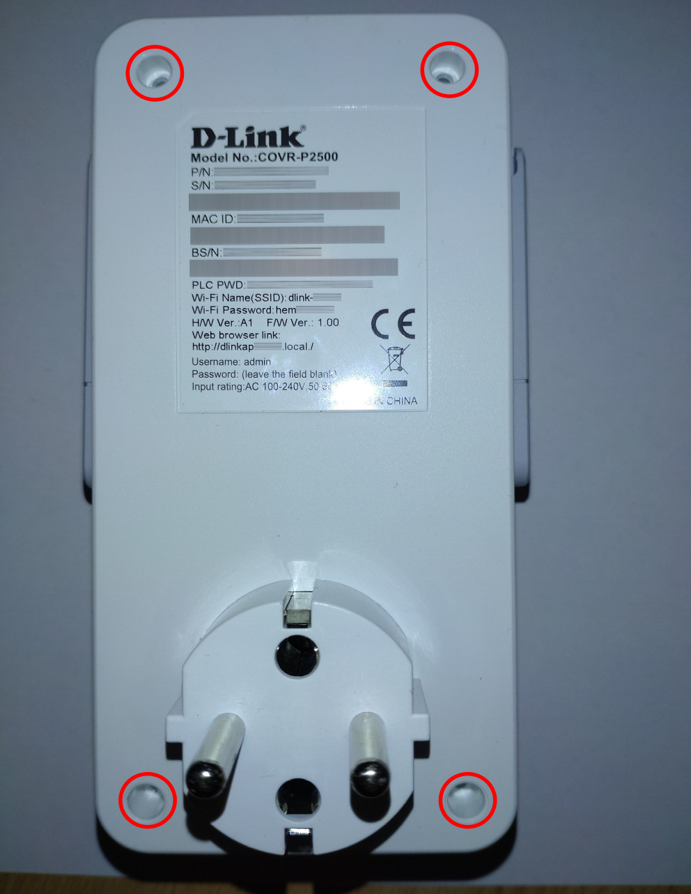
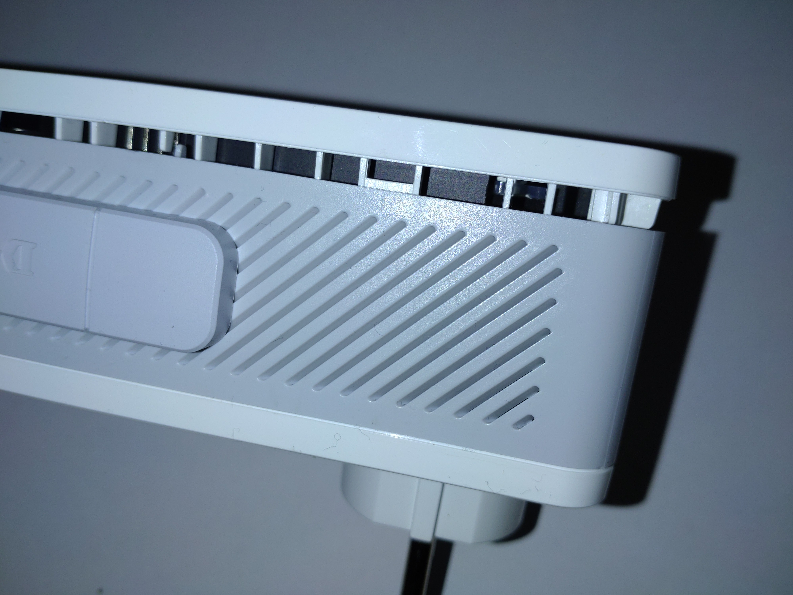
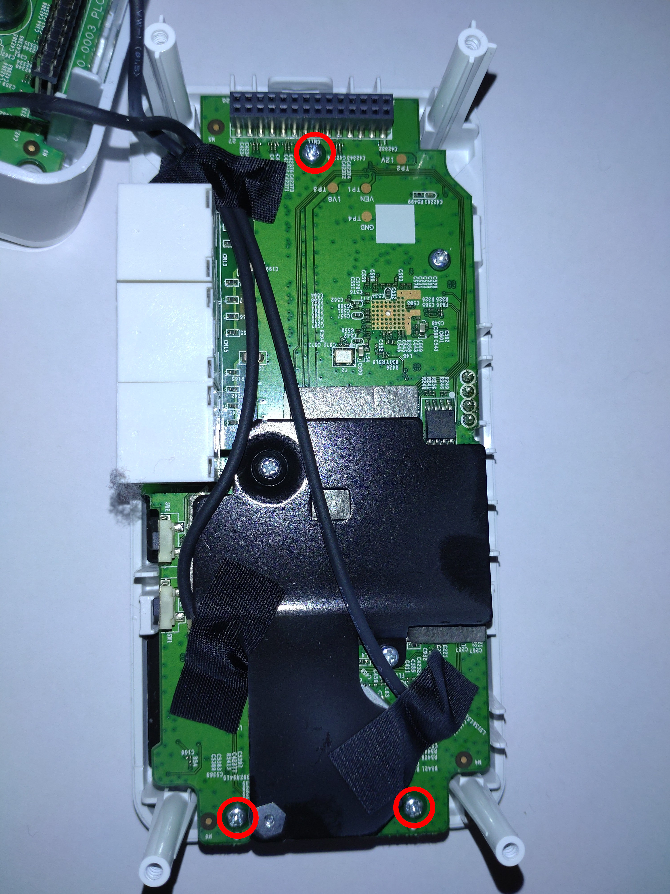
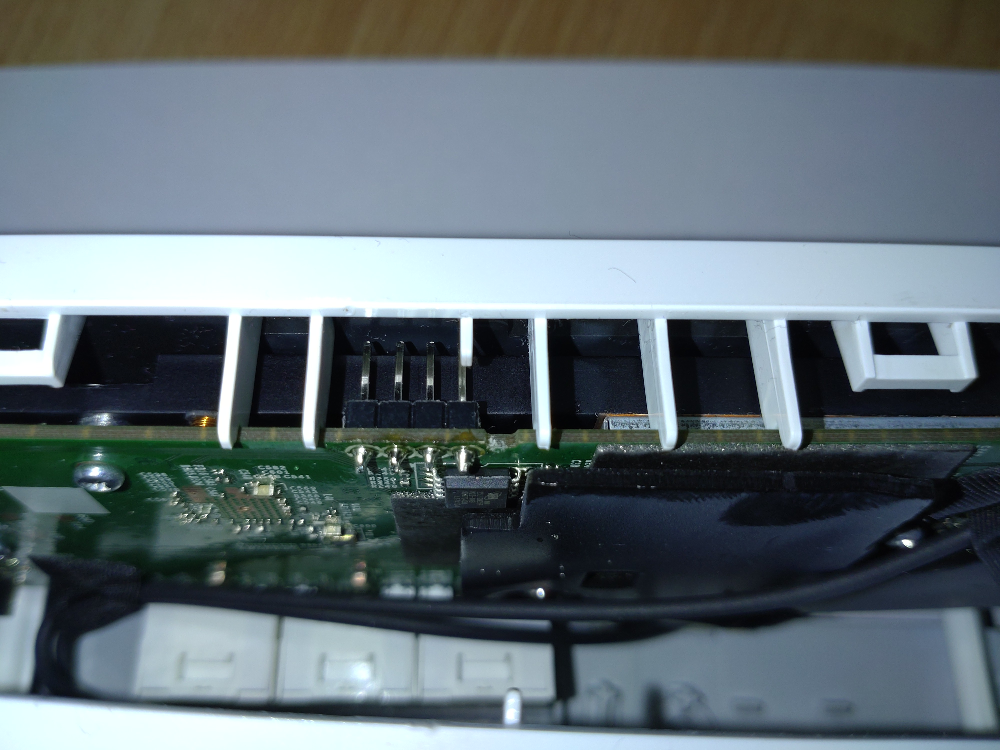

# OpenWRT image for D-Link COVR-P2500 A1

## Overview

This repository adds a build profile for D-Link COVR-P2500.  
Device configuration from [s-2's covr-2500_plctest branch](https://github.com/s-2/openwrt/tree/covr-2500_plctest).  
Build script based on [jwmullay's openwrt_wpa8630p_v2_fullmem](https://github.com/jwmullally/openwrt_wpa8630p_v2_fullmem).  

## Supported Devices

| Hardware Version |
| --- |
| `Model: COVR-P2500 Rev A1` |

## Building

Clone repository and run `make`

## Installation methods

### OEM Web UI

Login to http://covr.local/ (or with IP address). Navigate to Management -> Upgrade and upload \*squashfs-factory.bin.

OEM configuration is not compatible with OpenWRT so the device can't be accessed before reset. Wait long enough to make sure upgrade is finished and reset device with reset button. Use ethernet port 1 or 2 (ports closer to the centerline of the device) to access LUCI Web UI on http://192.168.1.1/.

### OEM Recovery UI

OEM Recovery UI does not work with modern operating systems. Recovery UI works without problems at least on Windows XP.

dlink_recovery_upload.py script allows uploading firmware but works only on linux. Implementation waits until TCP_INFO's tcpi_unacked is zero after every packet.

1. Power down the device
2. Press and hold the reset button on the device and re-plug the power without releasing the reset button
3. Continue to hold the reset button for 10 seconds. Power led should be orange
4. On the computer, manually assign a static IP address on the 192.168.0.xxx subnet, other than 192.168.0.50 (e.g. 192.168.0.100)
5. Run dlink_recovery_upload.py script `dlink_recovery_upload.py *squashfs-recovery.bin`
6. Wait until the script is finished. If the script gets stuck during upload power of the device and try again. Power led should be green after the device is booted.
7. On the computer, manually assign a static IP address on the 192.168.1.xxx subnet, other than 192.168.1.1 (e.g. 192.168.1.100)
8. Use ethernet port 1 or 2 (ports closer to the centerline of the device) to access LUCI Web UI on http://192.168.1.1/.

### From OpenWRT 18.06-SNAPSHOT r7704-9ee8c8daf4 (http://www.netadair.de/openwrt/)

!!! DO NOT FORCE FLASH \*squashfs-sysupgrade.bin

Release is not compatible with old loader. Force flash with \*squashfs-sysupgrade-openwrt1806.bin that also contains new loader.

```sh
sysupgrade -n -F *squashfs-sysupgrade-openwrt1806.bin
```

### Failsafe mode (with serial)

1. Boot device with serial attached
2. Wait until "Press the [f] key and hit [enter] to enter failsafe mode" and enter failsafe mode.
3. Verify that `cat /proc/mtd` contains firmware partition with size 00fa0000. With OpenWRT installed partition structure is different and flashings \*squashfs-recovery.bin to firmware partition might brick the device. (Use \*squashfs-sysupgrade.bin if size of firmware partition is 00f90000)
4. Get *squashfs-recovery.bin to /tmp directory
5. Flash with `mtd -r write /tmp/*squashfs-recovery.bin firmware`

### Failsafe mode (without serial)

Failsafe mode can be activated by pressing WPS button or reset button at the right time during startup. Correct time is approximately 10 seconds after the device is plugged on, but it is easier to continuoysly click WPS button during startup.

1. Power on the device
2. Continuously click WPS button for 20 seconds
3. Connect ethernet cable to the device and set local IP address to 192.168.1.100/24
4. Access device with `telnet 192.168.1.1`
5. Verify that `cat /proc/mtd` contains firmware partition with size 00fa0000. With OpenWRT installed partition structure is different and flashings \*squashfs-recovery.bin to firmware partition might brick the device. (Use \*squashfs-sysupgrade.bin if size of firmware partition is 00f90000)
6. Get \*squashfs-recovery.bin to /tmp directory
7. Flash with `mtd -r write /tmp/*squashfs-recovery.bin firmware`

### u-boot recovery (serial)

Setup tftpd server on 192.168.0.100 with *squashfs-recovery.bin named as 3200A8C0.img.
Start device with serial console attached and access u-boot console by pressing any key when promted.
Install image with commands:

```sh
tftpboot
erase 0x9f050000 +$filesize
cp.b $fileaddr 0x9f050000 $filesize
reset
```

## PLC

SSH to device and run `/etc/init.d/plc setup`. Make selections and start PLC with `/etc/init.d/plc start`. Alternatively you can download plc scripts from [netadair.de](http://www.netadair.de/openwrt/)

### Setup example

1. (optional) Download QCA75XX-2.10.0.0032_modules_5-6_stripped.nvm to /etc/plc directory. This version is reported to be more stable than version on stock firmware.

2. Run PLC setup helper

    ```text
    root@covrp2500_1:/etc/plc# /etc/init.d/plc setup
    Download original firmware and extract files from /lib/plc to /etc/plc [y|n] y
    Downloading 'http://pmdap.dlink.com.tw/PMD/GetAgileFile?itemNumber=FIR1800225&fileName=COVRP2500A1_FW101b08_decrypted.bin&fileSize=1.5990457E7;1.5992229E7;65141.0;'
    Connecting to 60.248.210.49:80
    Writing to 'COVRP2500A1_FW101b08_decrypted.bin'
    COVRP2500A1_FW101b08 15615k --:--:-- ETA
    Download completed (15990457 bytes)
    Parallel unsquashfs: Using 1 processor
    4 inodes (6 blocks) to write

    [===================================================================|] 6/6 100%

    created 4 files
    created 3 directories
    created 0 symlinks
    created 0 devices
    created 0 fifos
    created 0 sockets
    1) /etc/plc/COVRP2500AVA1_PIB100EU_WM.pib
    2) /etc/plc/COVRP2500AVA1_PIB100NA_WM.pib
    3) /etc/plc/COVRP2500AVA1_PIB100SG_WM.pib
    Select PibPath [1-3]: 1
    1) /etc/plc/MAC-7500-v2.2.2-03-X-CS.nvm
    2) /etc/plc/QCA7500-2.10.0032_modules_5-6_stripped.nvm
    Select NvmPath [1-2]: 2
    NetworkPasswd (leave empty to use default plc_networkpwd): SomePassword
    Enable plc [0-1]: 1
    Automatically add to br-lan bridge [0-1]: 0
    ```

3. Start plc service

    ```text
    root@covrp2500_1:/etc/plc# /etc/init.d/plc start
    ```

4. Check PLC connection status after another device connected

    NOTE! plctool does not work when eth0.3 is added to br-lan bridge

    ```text
    root@covrp2500_1:/etc/plc# plctool -i eth0.3 -m
    eth0.3 00:B0:52:00:00:01 Fetch Network Information
    eth0.3 XX:XX:XX:XX:XX:X Found 1 Network(s)

    source address = XX:XX:XX:XX:XX:XX

        network->NID = ZZ:ZZ:ZZ:ZZ:ZZ:ZZ:ZZ
        network->SNID = 15
        network->TEI = 1
        network->ROLE = 0x02 (CCO)
        network->CCO_DA = XX:XX:XX:XX:XX:XX
        network->CCO_TEI = 1
        network->STATIONS = 1

            station->MAC = YY:YY:YY:YY:YY:YY
            station->TEI = 2
            station->BDA = F4:B5:20:44:BC:DE
            station->AvgPHYDR_TX = 009 mbps Primary
            station->AvgPHYDR_RX = 009 mbps Primary

    ```

## Serial

Remove 4 skrews to open the device.



Remove 3 skrews holding upper PCB.


Solder 4 or 3 pin header (P3V3 not required). The PCB has labels GND, U-TX, U-RX and P3V3. By cutting a suitable hole in the case, the serial connector can be used after the case is closed.


Connect USB-TTL adapter to header (CND -> GND, RX -> U-TX and TX -> U-RX). Use baud rate 115200 (e.g. `screen /dev/ttyUSB0 115200`).

For some reason serial output is not readable on bootloader, but I managed to get output almost readable with `screen /dev/ttyUSB1 115200,cs7,cstopb`. Sending commands was not working with this configuration so I attached second USB-TTL adapter with only GND and RX connected so I got readable output on another terminal and sent commands with another terminal.
